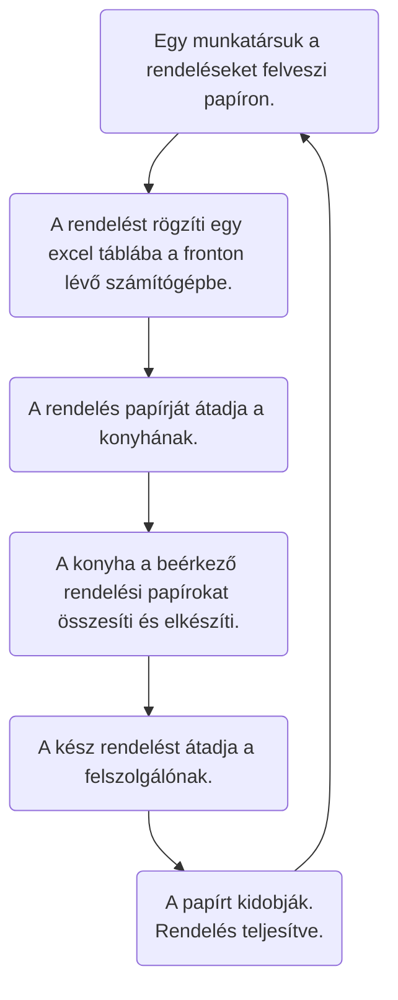
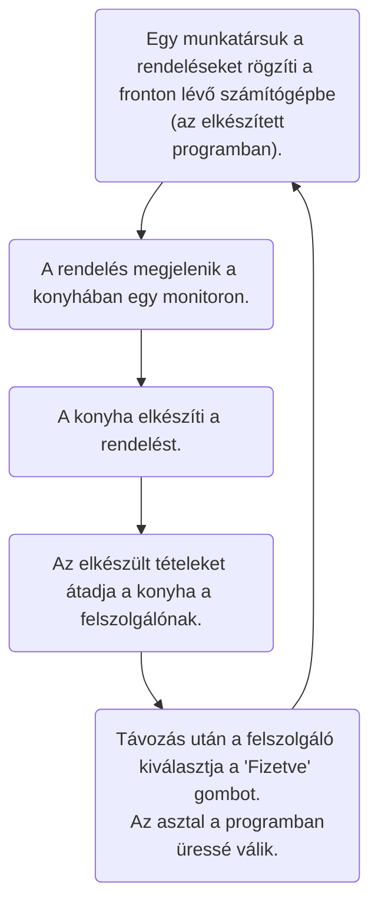

# Terraform követelmény specifikáció

### 1. Áttekintés
- Az ügyfél külsős informatikai szakértőket szeretne felvenni, akik megoldást tudnak nyújtani arra, hogy a cég feladatait sikeresen migrálják egy kiforrottabb automatizált megoldásba. 
Jelenleg sok emberi hiba történik a munkájuk során, több manuális lépés megtalálható meglévő folyamataikban.

- Olyan keretrendszert szeretnének, amely segít nekik minden eljárást automatizálni. 
Nem szeretnének bonyolult eszközöket használni, mert csapatuk számára azt nehéz lenne megérteni és megértetni. Emellett szeretnének együttműködni egy megosztott környezetben/keretrendszerben. 
Az ügyfél azt szeretné, hogy a project a lehető leghamarabb elkészüljön. 

### 2. Jelenlegi helyzet
- A Zsanng Kft 3 étterem többségi tulajdonosa. Fontos számukra a folyamatos fejlődés. Az elmúlt 2 évben bevezették az eldobható evőeszközöket, valamint szívószálaik is száraz tészta alapúak. Az elmúlt fél évben elérhető lett a házhozszállítás is.

- A rendelések rögzítése papíron történik. A papírt a pincér rögzíti a konyhában, majd a szakácsok elosztják egymás között a feladatokat. 
  
- A teltházas kiszolgálások megterhelőek lehetnek mind a konyhában és a fronton is. Ezáltal előfordulnak félreértések, hibás kiszolgálások.(Például: Nem azt rendelte a vendég, mint amit a konyhán elkészítettek.)

- A házhozszállítás bevezetésével tovább romlott a munkavégzés hatékonysága. A fronton dolgozók megpróbálták egy excel táblában vezetni az asztalok foglalásait, a rendeléseket valamint a teljes ellátás összegét. Ez nem vezetette az éttermet a megoldáshoz.

### 3. Vágyálom
A project célja egy olyan rendszer létrehozása, amely összehangolja és optimalizálja az étterem működését. Megkönnyíti a munkavégzés közbeni adminisztrációt. 

- Szeretnének egy bejelentkező felület.
- A bejelentkezést követően legyen lehetőség az asztal kiválasztásához, tételek kiírásához.
- Fontos, hogy egyszerűen javíthassák a félreütött rendeléseket.
- A vendégek távozása után tudjanak törölni asztalokat.
- A konyhán ugyanazok az információk legyenek elérhetőek, mint a fronton.
- A tételeket lehessen szerkeszteni, törölni bővíteni.
- A rendszer mutassa a tételek elkészítésének állapotát.

### 4. Jelenlegi üzleti folyamatok modellje:

### 5. Igényelt üzleti folyamatok modellje:

