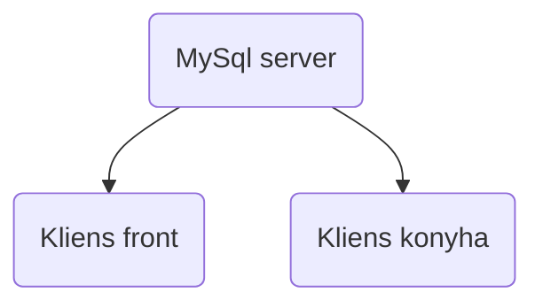

# Rendszerterv

## A rendszerrel szemben támasztott általános követelmények
- A rendszer funkcióit csak bejelentkezett felhasználó használhatja.
- A program .NET keretrendszerben íródik.
- Az adattárolás MySQL adatbáziban történik.

  
## Project terv
 - szerepkörök, felelőségek:
   
     Product owner:

               Vas Ádám

     Frontend:
   
               Hanzel Norbert
               Máté Gábor
               Magucsa-Rózsa Nikolett
               Bakos Zsolt
               Vas Ádám
   
     Backend:

               Hanzel Norbert
               Máté Gábor
               Magucsa-Rózsa Nikolett
               Bakos Zsolt
               Vas Ádám
   		
   Tesztelés:

               Hanzel Norbert
               Máté Gábor
               Magucsa-Rózsa Nikolett
               Bakos Zsolt
               Vas Ádám

Funkció|Feladat|Becsült idő|Felelős
--|------|---|--------
Követelmény specifikáció|Követelmény specifikáció kidolgozása|3 óra|Vas Ádám
Funkcionális specifikáció|Funkcionális specifikáció kidolgozása|3 óra|Vas Ádám
Rendszerterv|Rendszerterv kidolgozása|4 óra|Máté Gábor
Adattárolás|Adatbázis létrehozása|3 óra|Hanzel Norbert,Máté Gábor,Magucsa-Rózsa Nikolett
Login felület|Bejelentkezés / kijelentkezés funkció|2 óra|Magucsa-Rózsa Nikolett
Asztal foglalás|Asztalok foglalása funkció|3 óra| Hanzel Norbert
Tételek kiírás|Tételek hozzárendelése asztalhoz funkció|4 óra| Bakos Zsolt, Magucsa-Rózsa Nikolett

Kommunikáció: 

## Adatbázis terv
Karakterkódolás UTF-8.

#### Táblák:

- Felhasználó tábla
	- táblanév: user
	- mező nevek: 
		- id, PK
      - felh
      - jelszo

- Asztalok tábla
	- táblanév: asztalok
	- mező nevek: 
		- id, PK
      - fo

- Foglalás tábla
	- táblanév: foglalás
	- mező nevek: 
		- id, PK
      - asztal_id
      - nev
      - datum
      - kezdo_ido
      - vege_ido

- Rendelések tábla
	- táblanév: rendelesek
	- mező nevek: 
		- id, PK
      - fogl_id
      - tetel_id
      - adag

- Tételek tábla
	- táblanév: tetelek
	- mező nevek: 
		 - id, PK
      - nev
      - mertek_id
      - kategoria_id
 
- Egységárak tábla
	- táblanév: egysegarak
	- mező nevek: 
		- id, PK
      - tetel_id
      - egysegar

- Mértékegység tábla
	- táblanév: mertekegyseg
	- mező nevek: 
		- id, PK
      - nev

- Kategória tábla
	- táblanév: kategoria
	- mező nevek: 
		- id, PK
      - kat_nev
      - tipus_id
 
- Típus tábla
	- táblanév: tipus
	- mező nevek: 
		- id, PK
      - nev
